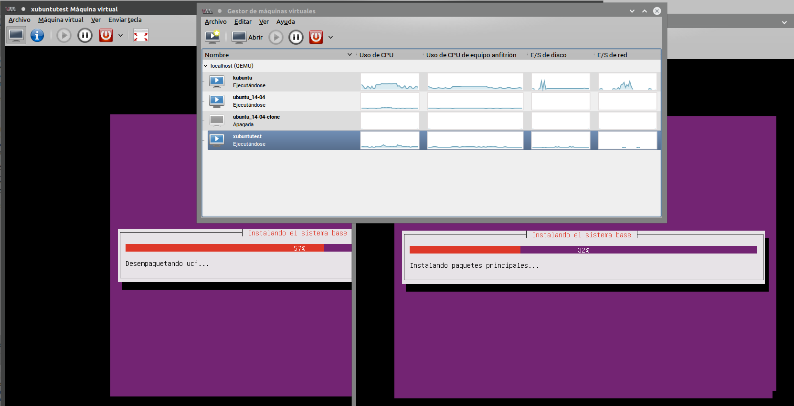

Script y conjunto de binarios y configuraciones para dejar funcionando un servidor de instalación por red automatizado. 

Introducción
===========

Estoy preparando unos scripts que permiten configurar rápidamente un ubuntu instalado de cero como servidor de instalación por red configurable para usar archivos preseed. 
Esta es una versión funcional, probada y pretendo que sirva para los FLISOL como para cualquier uso que se quiera dar para tener un servidor de instalaciones de Linux. 
Creé esto porque ví mucha complejidad en la primer experiencia que tuve para poner a funcionar un servidor de instalación por red, son muchos pasos a configurar y los manuales por lo general siempre dan ayuda a hacerlo de varias maneras, lo cual puede o no confundir un poco a quién lo quiera hacer. 

De momento solo configuré 2 preseed para **xubuntu y kubuntu trusty**, tanto para 32 como 64 bit, ambos instalan mucho software preseleccionado en el preseed, pero también carga un script con mucho más software y configuraciones customizadas y opciones que se pueden adaptar, todo sirve como ejemplo y cualquiera que entienda un poco de bash va a poder adaptarlo para muchos usos.

Espero que sirva mucho en varios casos, cualquier comentario es bienvenido. pablodav at gmail dot com. 
También aprovecho para invitar a cualquier persona que quiera colaborar en el mismo repositorio de git, de momento está en un repo personal que utilizo para meter muchos script linux, pero a futuro se puede mover solo esto a un proyecto aparte si a alguien le interesa. 

**Algunos de los pasos que realiza en instalador:** 
* Configura dhcp con ip 192.168.3.0/24 (se puede modificar en `/etc/dhcp/dhcpd.conf`)
* Instala dependencias de paquetes: isc-dhcp-server debmirror tftpd-hpa git nfs-kernel-server nginx
* Copia los archivos necesarios en `/var/lib/tftpboot/` para poder hacer el booteo 
* Configura nginx para poder descargar los archivos y copia archivos `html/netinstall` en `/usr/share/nginx/html`
* Configura un script para mirrorbuild en `/usr/local/bin/mirrorbuild.sh` 
 * Las instalaciones se podrán hacer offline, por lo que es útil para aislar la red que se usa para instalar
 * Luego se podrá instalar con y sin el repo local activado. 
* Configura una tarea cron para ejecutarse a las 00:00 en `/etc/cron.d/mirrorbuild
* Crea un enlace simbólico para poder usar el servidor como mirror `ln -s /home/UbuntuMirror/ /usr/share/nginx/html/ubuntu` 

**Algunas características extras además de toda la instalación automatizada con muchos paquetes en los script**
* Activa zram para mejorar el uso de memoria ram en los equipos, de momento lo activa siempre pero a futuro se podrá mejorar para solo usarlo en casos de menos de xGb de ram disponibles.
* Una vez que termina usa oem-config y deja listo para que en el próximo reinicio se configure el usuario su región, idioma, etc. 
* Activa usuario por defecto y password (ver archivo .seed) 

**Sobreescribe Todos los archivos de configuración por el momento, los repalda temporalmente en /tmp
Tenga en cuenta que si cambia la ip, también tendra que cambiar el script y preseeds en `html/netinstall`, el archivo `/var/lib/tftpboot/ubuntu-installer/i386/boot-screens/txt.cfg` para el menú de booteo.
Se precisarán por lo menos 100Gb en /home/UbuntuMirror** 

# Instalación
Requisitos: Tener configurada una tarjeta de red con ip 192.168.3.10 por lo menos después de instalar o con una red secundaria. 
Sinó como comento antes hay que cambiar las ip en los archivos.

Básicamente hay que bajar el archivo: 

> wget https://raw.githubusercontent.com/pablodav/linux-scripts/master/netinstall-ubuntu/net_installer.sh 

Darle permisos de ejecución

> chmod +x net_installer.sh

Y y ejecutarlo

> ./net_installer.sh 

Correr mirrorbuild.sh una vez para que sincronize el repositorio en /home/UbuntuMirror

# Uso de instalación por red

**La instalación no precisa internet ya que usa el repositorio local**

1. con el servidor conectado a una lan (switch), bootear por red las computadoras que se desean instalar (Normalmente tecla F12). 
 1.1. También se puede usar un [cd de netboot] (http://ipxe.org/start) si no tiene soporte la tarjeta de red. 
2. Elegir la versión a instalar y seguir los pasos. 
3. Una vez que reinició y pidió los datos del usuario (oeminstall), pueden quitar en los  orígenes de software el repo local. 

# Uso con virt-manager

Recomiendo el uso y testing con virt-manager, a mi me funcionó muy bien usando una red virtual ruteada para varias máquinas virtuales también. 

* **Usar monitor VNC** hasta que esté arreglado esto (cambiaré estos comentarios)
 * De momento tendrá que instalar ` sudo apt-get install xserver-xspice xserver-xorg-video-qxl ` a mano antes de cambiar a monitor spice.

# Repositorio git

Pueden clonarlo desde https://github.com/pablodav/linux-scripts 
Directorio netinstall-ubuntu 

Issues: 
Encontré algún error a bajo nivel y que los repos no funcionaban como esperaba, por eso abrí un milestone donde se pueden reportar issues por estos scripts: 
https://github.com/pablodav/linux-scripts/milestones/netinstall%20v1 

## Otros recursos utilizados:
**Documentation:** https://help.ubuntu.com/community/Installation/Netboot 
https://wiki.debian.org/DebianInstaller/Preseed
https://www.debian.org/releases/stable/i386/ch04s06.html.en
http://www.debian.org/releases/stable/i386/apb.html
https://wiki.debian.org/PXEBootInstall

**Used doc:** https://help.ubuntu.com/community/Installation/LocalNet
https://help.ubuntu.com/stable/installation-guide/en.i386/ch04s05.html
Section: Basic: Hands-On Interactive Network Server Edition Install 
dhcpd with tftp-hpa. and Advanced: Hands-Off, Preseeded Network Server Install
 
